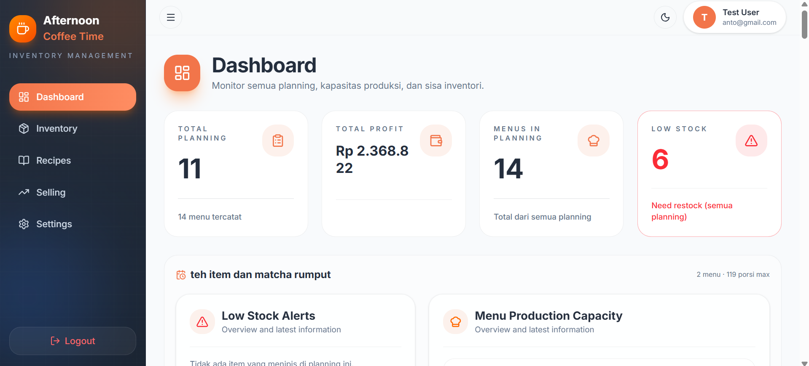

<!--
  Format: 
-->


# Afternoon Coffee Time Inventory Management

<!--
  DESKRIPSI SINGKAT (1-3 kalimat)
  Jawab: aplikasi ini buat apa, untuk siapa, masalah apa yang diselesaikan.
  Tidak perlu heading khusus — paragraf biasa langsung di bawah judul H1.
-->
Aplikasi manajemen inventori, resep, simulasi produksi, dan penjualan untuk bisnis minuman yang dibangun dengan React + Vite dan Express.js + MongoDB

<!--
  SCREENSHOT/DEMO (sangat disarankan — README dengan gambar jauh lebih menarik)
  Format gambar: 
  Simpan screenshot di folder /public atau /docs/images, lalu reference relatif.
-->


---

## 📋 Daftar Isi

<!--
  Opsional untuk README panjang — mempermudah navigasi.
  Format: link internal pakai (#judul-heading-dalam-huruf-kecil-pakai-strip)
-->
- [Fitur](#-fitur)
- [Tech Stack](#-tech-stack)
- [Struktur Folder](#-struktur-folder)
- [Prasyarat](#-prasyarat)
- [Instalasi](#-instalasi)
- [Environment Variables](#-environment-variables)
- [Menjalankan Project](#-menjalankan-project)
- [Alur Integrasi Backend](#-alur-integrasi-backend)
- [Known Issues](#-known-issues--limitations)
- [Kontributor](#-kontributor)

---

## ✨ Fitur

<!--
  List fitur utama aplikasi. Gunakan bullet list, boleh dikelompokkan per modul.
  Bisa juga pakai checklist (- [x]) untuk nunjukin fitur mana yang sudah/belum selesai.
-->
- **Dashboard Management** — tampilan grafik dan data secara visual
- **Inventory Management** — CRUD bahan baku dan tracking stok
- **Production Planning** — simulasi kebutuhan bahan tanpa mengubah stok
- **Recipe Management** — definisi menu resep dengan komposisi bahan dari Inventory
- **Selling Management** — simulasi penjualan beberapa menu yang mengurangi stok real-time

<!-- Contoh checklist untuk fitur yang masih progress -->
- [x] Autentikasi login/register
- [x] CRUD Inventory
- [ ] AI Companion
- [ ] Export laporan ke PDF *(belum selesai)*

---

## 🛠 Tech Stack

<!--
  Tabel adalah format terbaik untuk daftar tech stack — rapi dan mudah dipindai.
  Sintaks tabel Markdown:
  | Header 1 | Header 2 |
  |----------|----------|
  | isi      | isi      |
-->
| Kategori | Teknologi |
|---|---|
| Framework | React 19 + Vite |
| Styling | Tailwind CSS v4 |
| UI Components | shadcn/ui (Base UI) |
| Form & Validasi | React Hook Form + Zod |
| HTTP Client | Axios |
| Routing | React Router DOM |
| Icons | Lucide React |

---

## 📁 Struktur Folder

<!--
  Untuk struktur folder, pakai code block dengan bahasa "text" atau "bash"
  supaya font-nya monospace dan rapi. Tiga backtick untuk membuka/menutup.
-->
```text
src/
├── components/
│   ├── auth/         # Komponen autentikasi (login, register, dll)
│   ├── section/      # Komponen section (selling)
│   ├── shared/       # Komponen custom reusable
│   └── ui/           # Komponen dasar shadcn (Button, Input, dll)
├── context/          # Context (AuthContext, dll)
├── hooks/            # Custom hooks untuk data fetching (useLogin, usePlanning, useRecipes, dll)
├── layouts/          # Layout pembungkus halaman (MainLayout, AuthLayout, dll)
├── lib/              # Utility (axios instance, konversi unit, utils, dll)
├── models/           # Model data (Inventory, Recipe, Production, Selling)
├── pages/            # Halaman-halaman aplikasi, tempat koneksi route dengan component (DashboardPage, LoginPage, InventoryPage, dll)
├── routes/           # Definisi routing halaman-halaman aplikasi (AppRoutes)
├── services/         # Pemanggil API per modul (recipeService, inventoryService, dll)
├── App.jsx           # Komponen utama aplikasi, tempat koneksi route dengan component (AppRoutes, Toaster)
├── index.css         # Global styles (Tailwind CSS v4)
└── main.jsx          # Titik masuk aplikasi (entry point), merender component utama (App)
```

---

## ✅ Prasyarat

<!--
  Requirement sebelum instalasi — versi Node.js, package manager, dll.
  List biasa sudah cukup.
-->
- Node.js versi 18 atau lebih baru
- npm atau yarn
- Backend API sudah berjalan (lihat repo [backend-dev](https://github.com/505-kada-team/backend-dev))

---

## 🚀 Instalasi

<!--
  LANGKAH INSTALASI — WAJIB pakai code block supaya command bisa di-copy
  langsung oleh pembaca dengan satu klik (GitHub kasih tombol copy otomatis
  di pojok kanan atas code block).
  Gunakan bahasa "bash" setelah tiga backtick untuk syntax highlighting command line.
-->
```bash
# Clone repository
git clone https://github.com/505-kada-team/frontend-dev

# Masuk ke folder project
cd frontend-dev

# Install dependencies
npm install
```

---

## 🔐 Environment Variables

<!--
  Jelaskan env variable yang dibutuhkan. Kombinasi tabel (penjelasan)
  + code block (contoh isi file .env).
-->
Buat file `.env` di root project, isi dengan:

```env
VITE_API_URL=http://localhost:5000/api/v1
```

| Variable | Keterangan | Wajib? |
|---|---|---|
| `VITE_API_URL` | Base URL backend API | Ya |

<!--
  Tips: kalau ada banyak env variable, sertakan juga file .env.example
  di repo (tanpa isi sensitif) supaya kontributor lain tinggal copy.
-->
> **Catatan:** Jangan commit file `.env` ke repository — pastikan sudah ada di `.gitignore`.

---

## ▶️ Menjalankan Project

<!--
  Jelaskan tiap script npm yang tersedia — ambil dari package.json "scripts".
  Format tabel + code block sama seperti di atas.
-->
```bash
# Development server (hot-reload)
npm run dev

# Build untuk production
npm run build

# Preview hasil build
npm run preview

# Cek linting
npm run lint
```

Aplikasi akan berjalan di `http://localhost:5173` (default Vite).

---

## 🔗 Alur Integrasi Backend

<!--
  Ini bagian penting untuk README frontend — jelaskan singkat gimana
  frontend "ngobrol" sama backend. Diagram alur sederhana bisa pakai
  code block ASCII, atau kalau mau visual, embed gambar/mermaid diagram.

  GitHub mendukung Mermaid langsung di dalam code block ```mermaid
  (dirender otomatis jadi diagram visual di halaman repo).
-->
```
User Action → React Hook Form (validasi Zod) → services/*.js (axios)
→ Backend API → Response → hooks/*.js (update state) → UI re-render
```

<!-- Detail lengkap arsitektur ada di [dokumentasi-arsitektur-aplikasi.md](./docs/dokumentasi-arsitektur-aplikasi.md). -->

---

## ⚠️ Known Issues & Limitations

<!--
  Jujur soal keterbatasan project itu PENTING — nunjukin kamu paham
  batasan sistem, bukan cuma "yang bagus-bagus aja".
  Bullet list biasa, atau tabel kalau perlu kolom "status/rencana".
-->
- Pagination pada modul Planning masih client-side (belum terhubung ke `meta` dari backend)
- Rate limiting backend cukup ketat di environment development
- Validasi unit ingredient di form Resep terbatas pada kategori massa/volume/hitungan
- Pop up modal masih bertumpuk sampai tiga lapis
- Penamaan inventory belum menggunakan kode khusus

---

## 👥 Kontributor

<!--
  Tabel dengan foto profil GitHub (opsional) — format umum di banyak
  README open source.
-->
| Nama | Peran | GitHub |
|---|---|---|
| Muhammad Daffa Fisabilillah | Backend Developer & PM | [@braceskabane](https://github.com/braceskabane) |
| Arianto | Backend Developer | [@arianto31](https://github.com/arianto31) |
| Fadya Amalia | Backend Developer | [@fadyaamalia](https://github.com/fadyaamalia) |
| Ansel Caprico | UI/UX Designer | [@Ansel69](https://github.com/Ansel69) |
| Yulian Dwi Nartriani | Frontend Developer | [@YulianDwiNartriani](https://github.com/YulianDwiNartriani) |
| Nurul Afiyah| Frontend Developer | [@nafiyah99](https://github.com/nafiyah99) |

---

## 📄 Lisensi

<!--
  Opsional untuk project capstone/pribadi. Kalau tidak perlu, hapus section ini.
-->
Project ini dibuat untuk keperluan proyek pracapstone 
